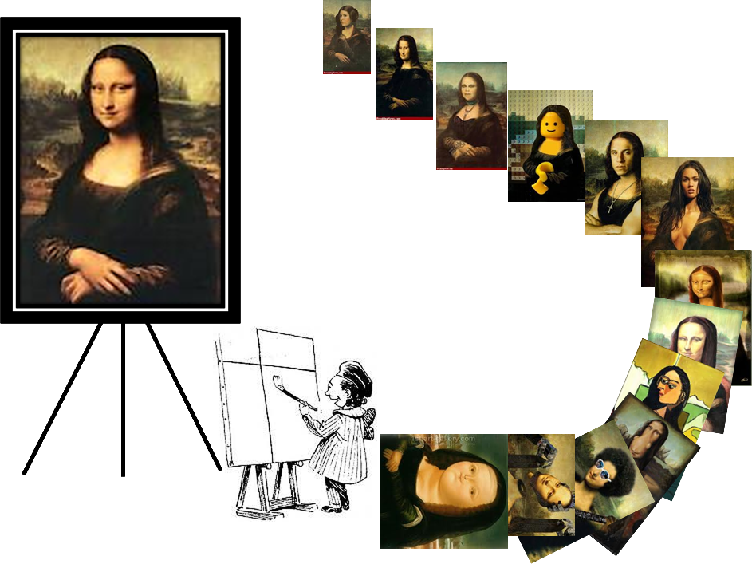

```{r setup geral}
#| include=FALSE

knitr::opts_chunk$set(
  echo = TRUE,
  message = FALSE,
  warning = FALSE,
  fig.width = 14,
  fig.height = 7
)
```

## Contextualização

<br>

<div align=justify style="text-indent: 3em;">
Criado inicialmente para avaliar a qualidade do ensino no Brasil, o Exame Nacional do Ensino Médio não só constitui a principal forma de acesso à educação superior de mais de 500 universidades públicas e privadas do pais, como também serve de base para formulação de políticas públicas para a educação. Ele pode ser usado pelo Estado como indicador de qualidade do ensino nas escolas públicas e privadas.

Os dados históricos do ENEM, disponibilizados pelo Instituto de Estudos e Pesquisas Educacionais Anísio Teixeira, tem sido objeto de diversos estudos em que técnicas de análise são aplicadas por meio de linguagens de programação como Python, R, Java, entre outras.

Entretanto, embora os dados estejam disponíveis à sociedade na forma de microdados, não existem ferramentas gratuitas que permitam ao cidadão ter acesso às informações geradas a partir destes dados.


Este projeto tem como propósito elaborar um relatório em html com o resultado do desempenho dos alunos de um município brasileiro, de forma reprodutível, ou seja, gerando relatórios diversos a depender do nome do município fornecido no próprio documento antes da renderização.
<br>

</div>

```{r inclusão de figura}
#| fig.align = "center",
#| out.width = "40%",
#| echo = FALSE




```
<br>

## Metodologia

<div align=justify style="text-indent: 3em;">
Trabalhei com os dados disponíveis no site do [Instituto Nacional de Estudos e Pesquisas Educacionais Anísio Teixeira](https://www.gov.br/inep/pt-br/acesso-a-informacao/dados-abertos/microdados/enem) dos anos 2018, 2019 e 2020 (acesso em 20/05/2022).

Os arquivos possuem as seguintes especificações: 2018 com 5513.733 linhas (2,6 GB), 2019 com 5.095.171 linhas( 2,4 GB) e 2020 com 5.783.109 linhas (2GB).

Em função dos tamanhos dos arquivos, utilizei apenas os dados do estado do Paraná e seus municípios.

</div>

<br>


<br>

## Relatório - Município de `r params$cidade`/ `r params$estado`.

<br>


```{r Lista dos estados da federacao}
#| echo = FALSE

estado_federacao <- dplyr::case_when(
    params$estado == "AC" ~ "Acre",
    params$estado == "AL" ~ "Alagoas",
    params$estado == "AP" ~ "Amapá",
    params$estado == "AM" ~ "Amazonas", 
    params$estado == "BA" ~ "Bahia", 
    params$estado == "CE" ~ "Ceará", 
    params$estado == "DF" ~ "Distrito Federal", 
    params$estado == "ES" ~ "Espírito Santo", 
    params$estado == "GO" ~ "Goiás",
    params$estado == "MA" ~ "Maranhão", 
    params$estado == "MT" ~ "Mato Grosso",
    params$estado == "MS" ~ "Mato Grosso do Sul",
    params$estado == "MG" ~ "Minas Gerais", 
    params$estado == "PA" ~ "Pará", 
    params$estado == "PB" ~ "Paraíba", 
    params$estado == "PR" ~ "Paraná",
    params$estado == "PE" ~ "Pernambuco", 
    params$estado == "PI" ~ "Piauí", 
    params$estado == "RJ" ~ "Rio de Janeiro", 
    params$estado == "RN" ~ "Rio Grande do Norte",
    params$estado == "RS" ~ "Rio Grande do Sul", 
    params$estado == "RO" ~ "Rondônia", 
    params$estado == "RR" ~ "Roraima", 
    params$estado == "SC" ~ "Santa Catarina",
    params$estado == "SP" ~ "São Paulo",
    params$estado == "SE" ~ "Sergipe",
    params$estado == "TO" ~ "Tocantins"
)

```


```{r Leitura da base de dados}
#| echo = FALSE
enem <- readr:: read_csv("../data/enem_analise_final.csv")

```
<br>

## Desempenho na Redação

<br>

<div align=justify style="text-indent: 3em;">
A nota da redação é composta por cinco competências com notas que variam de 0 a 200 pontos. A soma das competências resulta na nota final da redação do aluno.

São as seguintecompets competências:

- dominío da norma padrão da Língua Portuguesa;
- compreensão da proposta da redação;
- emprego de mecanismos linguísticos alternativos;
- elaboração de uma proposta de intervenção para o problema abordado.

<br>

```{r plot1 - Media dos componentes da redacao}

# ANÁLISES DAS MÉDIAS DAS NOTAS QUE COMPÕEM AS NOTAS DA REDAÇÃO

# Cálculo das médias dos componentes da redação
medias_comp_redacao <- enem |>
  dplyr::filter(nu_ano == 2018, no_municipio_prova == params$cidade) |>
  dplyr::summarise(dplyr::across(
    .cols = dplyr::starts_with("nu_nota_comp"),
    .fns = mean, na.rm = TRUE
  ))

medias_comp_redacao <- medias_comp_redacao |>                            # renomear as variáveis
  dplyr::rename(
    "comp1" = "nu_nota_comp1",
    "comp2" = "nu_nota_comp2",
    "comp3" = "nu_nota_comp3",
    "comp4" = "nu_nota_comp4",
    "comp5" = "nu_nota_comp5"
  )


# VISUALIZAÇÃO DO RESULTADO

# Pivotar a base para long
medias_comp_redacao <- medias_comp_redacao |>
    tidyr::pivot_longer(
        cols = c(
            "comp1",
            "comp2",
            "comp3",
            "comp4",
            "comp5"),
        names_to = "notas_comp_redacao",
        values_to = "medias") |>
    dplyr::mutate(notas_comp_redacao = as.factor(notas_comp_redacao))

# Cosntruir o gráfico de barras das médias dos componentes que compõem a nota da redação
p1 <- medias_comp_redacao |>                                            # base
  dplyr::mutate(
    notas_comp_redacao = forcats::fct_reorder(
      notas_comp_redacao,
      medias,
      .desc = TRUE
    )
  ) |>
  ggplot2::ggplot() +                                                   # gráfico
  ggplot2::aes(
    x = notas_comp_redacao,
    y = medias,
    label = round(medias, 2)
  ) +
  ggplot2::geom_col(
    fill = "#576BC7"
  ) +
  ggplot2::geom_label(                                                  # labels
    size = 4,
    color = "#D6F3FF",
    alpha = 0,
    nudge_y = -10
  ) +
  ggplot2::labs(                                                        # títulos dos eixos
    title = "Médias dos componentes da redação",
    subtitle = "A nota da redação é definida pela soma dos componentes",
    x = "notas dos componentes",
    y = "média das notas"
  ) +
  ggplot2::theme_classic() +                                            # tema
  ggplot2::theme(
    legend.position = "none"
  ) +
  ggplot2::theme(                                                       # customização do tema
    panel.background = ggplot2::element_rect(fill = "#D6F3FF"),                # cor do fundo do gráfico
    plot.background = ggplot2::element_rect(fill = "#D6F3FF"),                 # cor da grade externa
    plot.margin = ggplot2::unit(c(1, 2, 1, 1), "cm"),                          # distância das margens
    plot.title = ggplot2::element_text(                                        # título do gráfico.
      size = 18,                                                                     # tamanho da fonte
      face = "bold",                                                                # não negrito
      family = "",                                                                   # fonte do título
      hjust = 0,                                                                     # posição na horizontal
      margin = ggplot2::unit(c(0, 0, 0.5, 0.5), "cm")                                # margens do título
    ),
    plot.subtitle = ggplot2::element_text(                                     # subtítulo
      size = 11,                                                                     # tamanho da fonte
      family = "",                                                                   # fonte do subtítulo
      hjust = 0,                                                                     # posição na horizontl
    ),
    text = ggplot2::element_text(                                              # textos config. geral de texto
      family = "",                                                                   # fonte
      color = "#000E14",                                                             # cor
      size = 13,                                                                     # tamanho da fonte
      hjust = 0,                                                                     # posição na horizontal
      face = "bold"                                                                  # negrito
    ),
    axis.title = ggplot2::element_text(                                        # texto do título do eixo x e y
        face = "bold",                                                                 # negrito
        size = 13,                                                                     # tamanho
        hjust = 0.5,                                                                   # posição na horizontal
    ),
    axis.text.x = ggplot2::element_text(                                       # texto do eixo x
      color = "#000E14",                                                             # cor
      size = 11,                                                                    # tamanho
      face = "plain",                                                                 # negrito
      margin = ggplot2::unit(c(0.3, 0, 0.5, 0), "cm")                                # margens do texto
    ),
    axis.text.y = ggplot2::element_text(                                       # texto do eixo y
      color = "#000E14",                                                             # cor
      size = 11,                                                                    # tamanho
      face = "plain",                                                                 # negrito
      family = "",                                                                   # fonte
      margin = ggplot2::unit(c(0, 0.5, 0, 0.5), "cm")                                # margens do texto
    ),
    axis.ticks.x = ggplot2::element_line(color = "#1F1F1F"),                   # ticks do eixo x
    axis.line.x = ggplot2::element_line(color = "#1F1F1F"),                    # cor da linha do eixo x
    axis.ticks.y = ggplot2::element_line(color = "#1F1F1F"),                   # padrões dos ticks do eixo x
    axis.line.y = ggplot2::element_line(color = "#1F1F1F"),                    # cor da linha do eixo y
  )

p1

```
</div>


```{r competencias da redacao com maior e menor média}

comp_max <- medias_comp_redacao |> 
    dplyr::slice_max(order_by = medias)

comp_min <- medias_comp_redacao |> 
    dplyr::slice_min(order_by = medias)

melhor_componente_redacao <- dplyr::case_when(
    medias_comp_redacao[["medias"]][1] == comp_max ~ "componente um",
    medias_comp_redacao[["medias"]][2] == comp_max ~ "componente dois",
    medias_comp_redacao[["medias"]][3] == comp_max ~ "componente três",
    medias_comp_redacao[["medias"]][4] == comp_max ~ "componente quatro",
    medias_comp_redacao[["medias"]][5] == comp_max ~ "componente cinco"
)


pior_componente_redacao <- dplyr::case_when(
    medias_comp_redacao[["medias"]][1] == comp_min ~ "componente um",
    medias_comp_redacao[["medias"]][2] == comp_min ~ "componente dois",
    medias_comp_redacao[["medias"]][3] == comp_min ~ "componente três",
    medias_comp_redacao[["medias"]][4] == comp_min ~ "componente quatro",
    medias_comp_redacao[["medias"]][5] == comp_min ~ "componente cinco"
    )

```

<div align=justify style="text-indent: 3em;">
Os alunos da cidade de `r params$cidade` obtiveram o melhor desempenho no `r melhor_componente_redacao` com média de 

</div>
